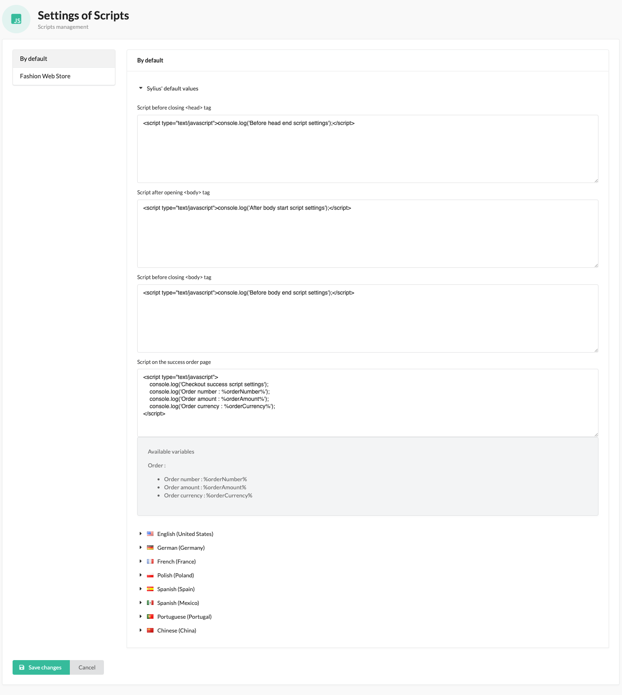
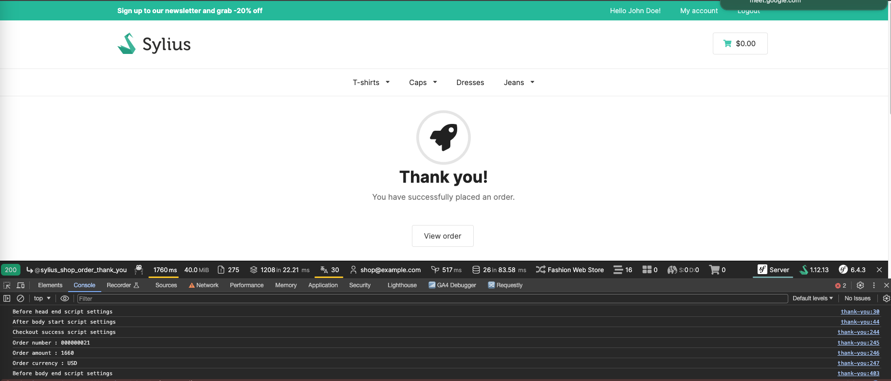

<p align="center">
    <a href="https://monsieurbiz.com" target="_blank">
        
    </a>
    &nbsp;&nbsp;&nbsp;&nbsp;
    <a href="https://monsieurbiz.com/agence-web-experte-sylius" target="_blank">
        
    </a>
    <br/>
    
</p>

<h1 align="center">Scripts Settings for Sylius</h1>

[](https://github.com/monsieurbiz/SyliusScriptsPlugin/blob/master/LICENSE)
[](https://github.com/monsieurbiz/SyliusScriptsPlugin/actions?query=workflow%3ATests)
[](https://github.com/monsieurbiz/SyliusScriptsPlugin/actions?query=workflow%3ASecurity)

This plugin lets you add JS scripts from the admin panel. You can add scripts to the header or the footer of your website.  
For example, add Google Analytics, Facebook Pixel, or any other tracking script.

# Installation

```bash
composer require monsieurbiz/sylius-scripts-plugin
```

Create the config file in `config/packages/monsieurbiz_sylius_scripts_plugin.yaml`:

```yaml
imports:
    resource: '@MonsieurBizSyliusScriptsPlugin/Resources/config/config.yaml'
```

# Configuration

Go to the admin panel, then `Settings` > `Scripts` and add your scripts:



And that's it! Your scripts will be added:



# How to

## Change the default settings values for your project

Open the `config/packages/monsieurbiz_sylius_scripts_plugin.yaml` file and change the default values. For example:

```yaml
monsieurbiz_sylius_settings:
    plugins:
        monsieurbiz_scripts.scripts:
            default_values:
                before_head_end: |
                    <script type="text/javascript">console.log('My script');</script>
```
